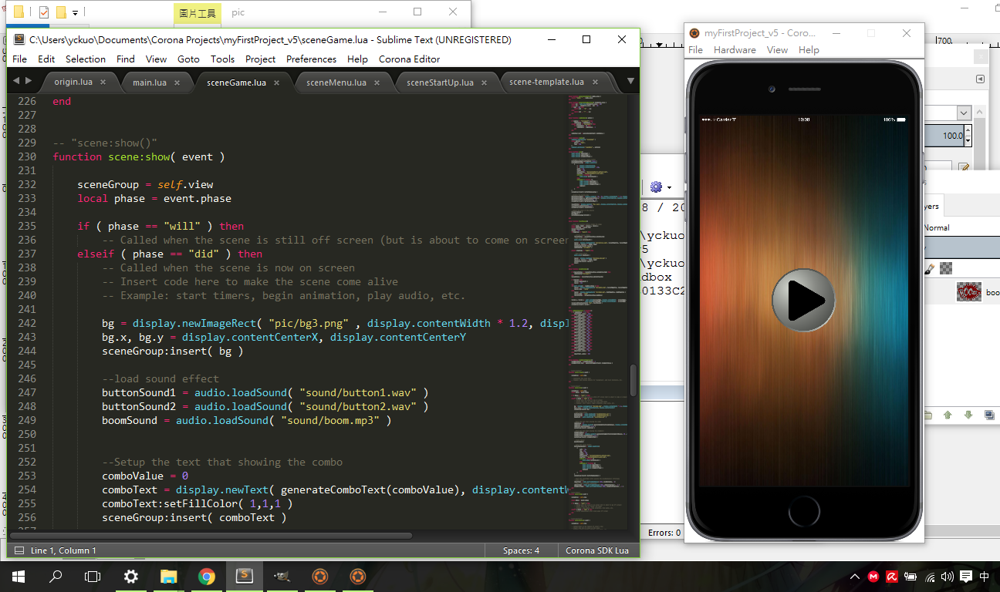
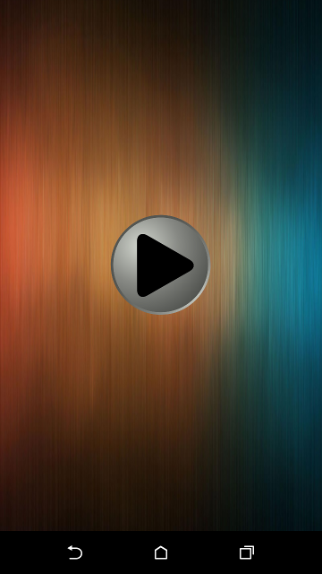
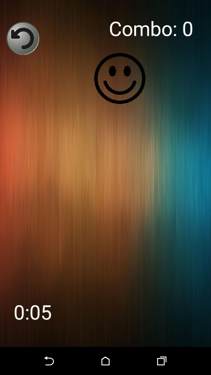
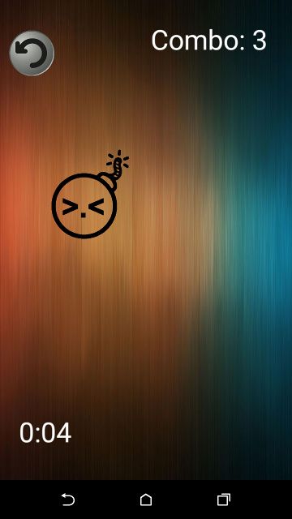
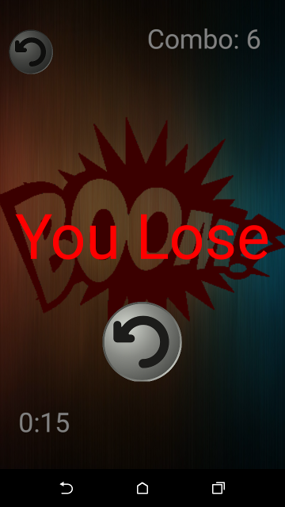

# Get-the-Smiles
這是我在大二上的程式語言課程分組報告，為了介紹Lua而寫的Android小遊戲。

>* Programming Lauguage: [Lua](https://www.lua.org/) 
>* Tools: [Corona SDK](https://coronalabs.com/)

## 遊戲下載
點[這裡](release/Get_the_Smiles.apk?raw=true)可以下載遊戲(Android Apk)

## 遊戲操作說明
* 笑臉會在隨機位置出現。點擊笑臉可以獲得Combo數，若成功抓到一個笑臉則combo數+1，如果miss掉則combo數-1。越到後面笑臉出現速度會越來越快。
* 笑臉中會穿插*炸彈*出現，點擊到炸彈則直接爆炸，遊戲結束
* 試試看自己最高能夠多少combo吧 ^_^
* p.s. 本遊戲有音效，可以開啟聲音來玩

## 遊戲截圖

遊戲開發中畫面

遊戲畫面

